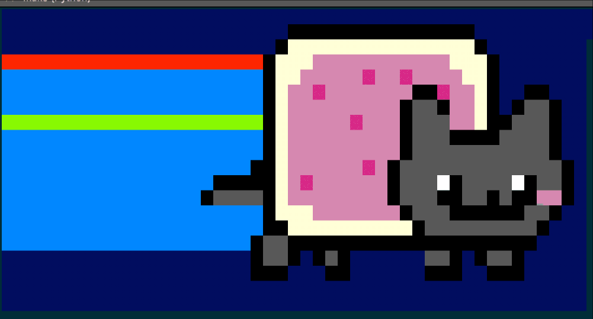

## CCC1718 - Nyan WIFI For ESP8266

**In Just 1352 bytes**



[*Watch On Youtube*](https://www.youtube.com/watch?v=J-RLWhml-Xg)


A Nyan Cat wifi traffic visualisation. Depicts each of the 13 2.4GHz
channels traffic as the rainbow trail behind the cat. The noisier the channel, the closer to red the colour goes!

Wifi traffic capture is done by putting the ESP8266 WiFI into monitor mode, and capturing packets.

In addition, plays Nyan Cat theme song out of GPIO 3.

The visualisation is intended to be run on an [ESP8266-01](https://www.sparkfun.com/products/13678), but I imagine it will
happily port to other variants of the ESP8266.

Using no libraries other than the platform provided by [PlatformIO](http://platformio.org/) / [ESP8266Arduino](https://github.com/esp8266/Arduino)

Pre-minified source exists in [`pre-min/`](pre-min/)
  - `main.orig.cpp`: The OG code. Non minified, no symbols renamed
  - `min.min1.cpp`: The OG code with renamed symbols

Minified source exists in [`src/`](src/)
  - `main.cpp`: Renamed symbols, and minified via [cminify](https://github.com/Scylardor/cminify).

## Resources

In order for the application to run, the image data and audio data must be flashed
to the ESP's flash memory. This can be done with:

```
make upload_resources
```

Resources are built/generated using various tools in the [`tools/`](tools/) directory:

- `make_cat_data.py`: Builds the coloured frames based on a text-only representations. Writes out a bin file to be flashed.
- `make_tone_data.py`: Builds the binary tune file to be played, using an input text-based tune file.
- `mem_layout.py`: Used to determine optimal memory layout based on binary resource sizes.
- `play_tones.py`: A python script to play a binary tune file. Was used for testing before implementing tune player on the ESP.
- `term-size.py`: A tool used to test VT100 term codes to determine terminal size.


## Building

```
make build
```

You will need to have [platformIO](http://platformio.org/) installed.

## Running

```
make upload
```

This will flash the program to the ESP.

```
make monitor
```

This will connect to the ESP via Serial. Ensure there is a speaker plugged in the Audio output port for maximum entertainment.
